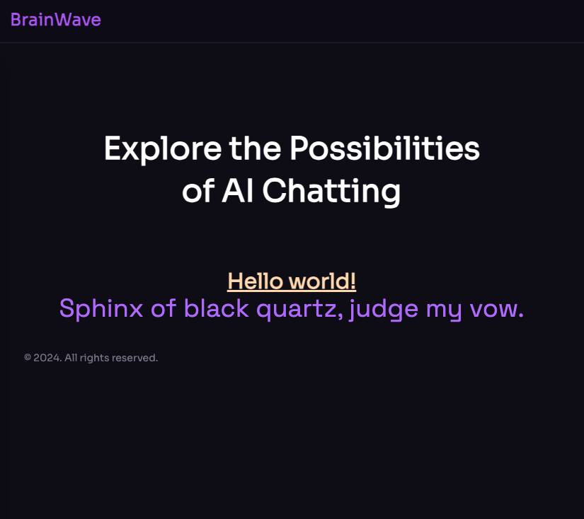

# root div class

```html
## layout.svelte
<div class="pt-[4.75rem] lg:pt-[5.25rem] overflow-hidden">
</div>
```

## components

### header
```html
<div class="fixed top-0 left-0 w-full z-50  border-b border-n-6 lg:bg-n-8/90 lg:backdrop-blur-sm bg-n-8/90 backdrop-blur-sm">
    <div class="flex items-center px-5 lg:px-7.5 xl:px-10 max-lg:py-4"> 
       <h2> BrainWave </h2>
    </div>
</div>
```

### Hero

```html
<section class="pt-[12rem] -mt-[5.25rem]" id="hero">
    <div class="container relative" >
        <div class="relative z-1 max-w-[62rem] mx-auto text-center mb-[3.875rem] md:mb-20 lg:mb-[6.25rem]">
            <h1 class="h1 mb-6">
                Explore the Possibilities of&nbsp;AI&nbsp;Chatting 
            </h1>
        </div>
    </div>
</section>
```

### Footer

```html
<section class="!px-0 !py-10">
    <div class="container flex sm:justify-between justify-center items-center gap-10 max-sm:flex-col">
        <p class="caption text-n-4 lg:block">
            © {new Date().getFullYear()}. All rights reserved.
          </p>
    </div>
</section>
```

## result
