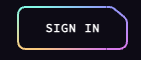

# design the Header

## logo

Put the assets in `static` folder

```

```

To improve the performance, the better way is using the **Vite's built-in handling**, we need move the assets to `lib/assets` folder, and import images in svelte components.

```html
// import logo svg
<script>
import brainwave from '$lib/assets/brainwave.svg';
</script>
// in the html
<a class="block w-[12rem] xl:mr-8" href="#hero">
  
</a>
```

## nav links

## gradient button


- create the reuseable svelte component
- can render to a link or a button depending the href value.
- gradient boarder